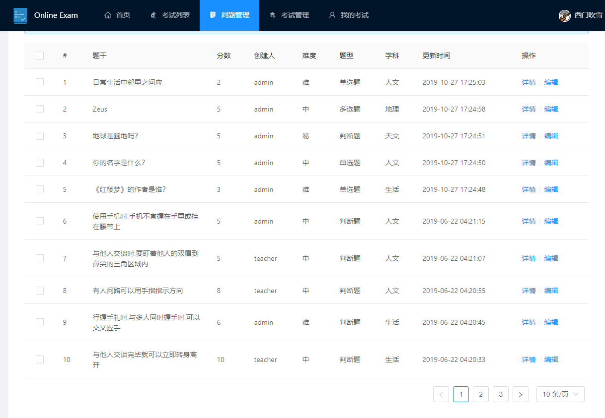
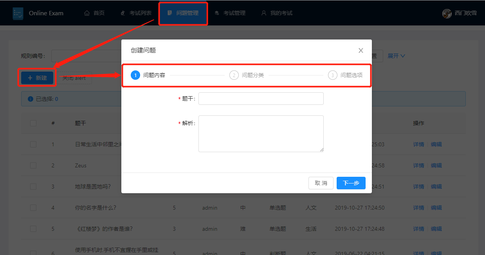
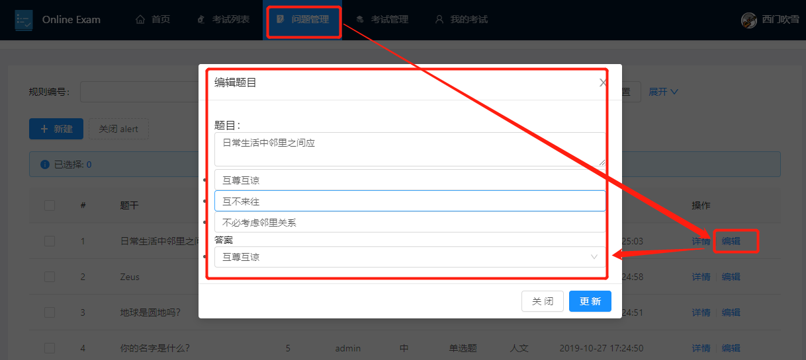
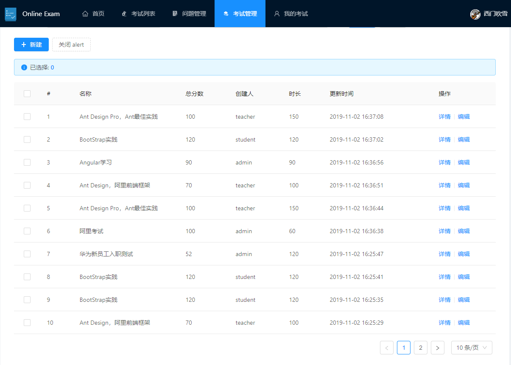
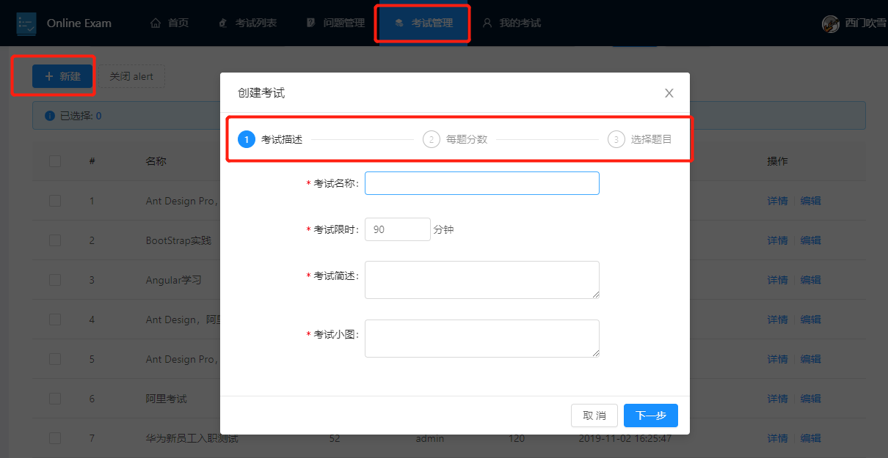
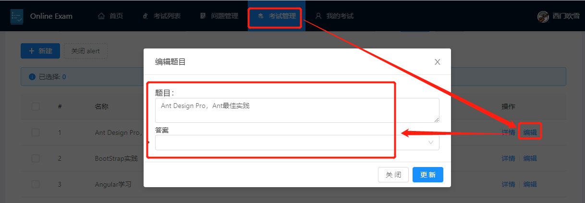
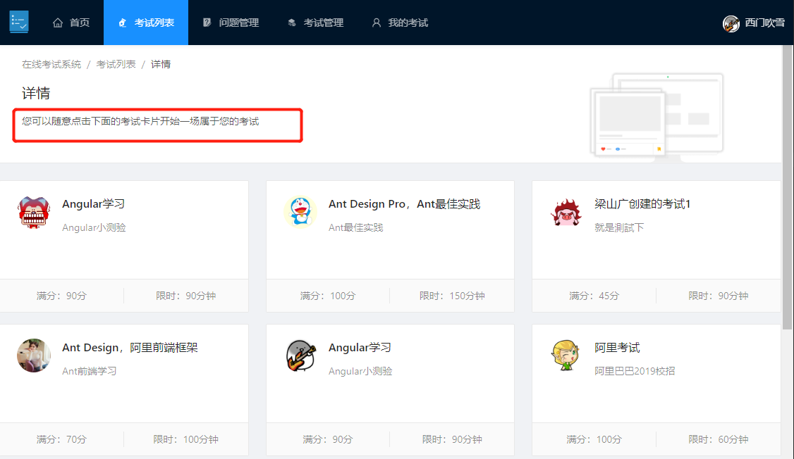
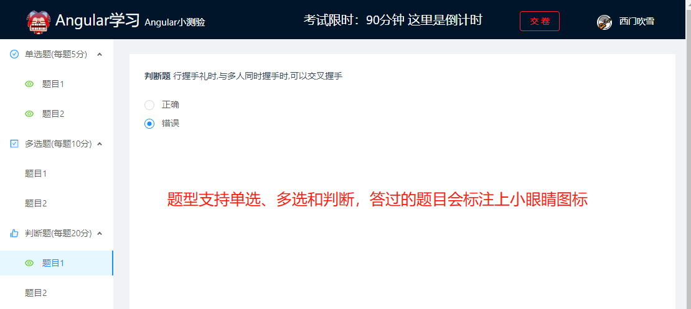
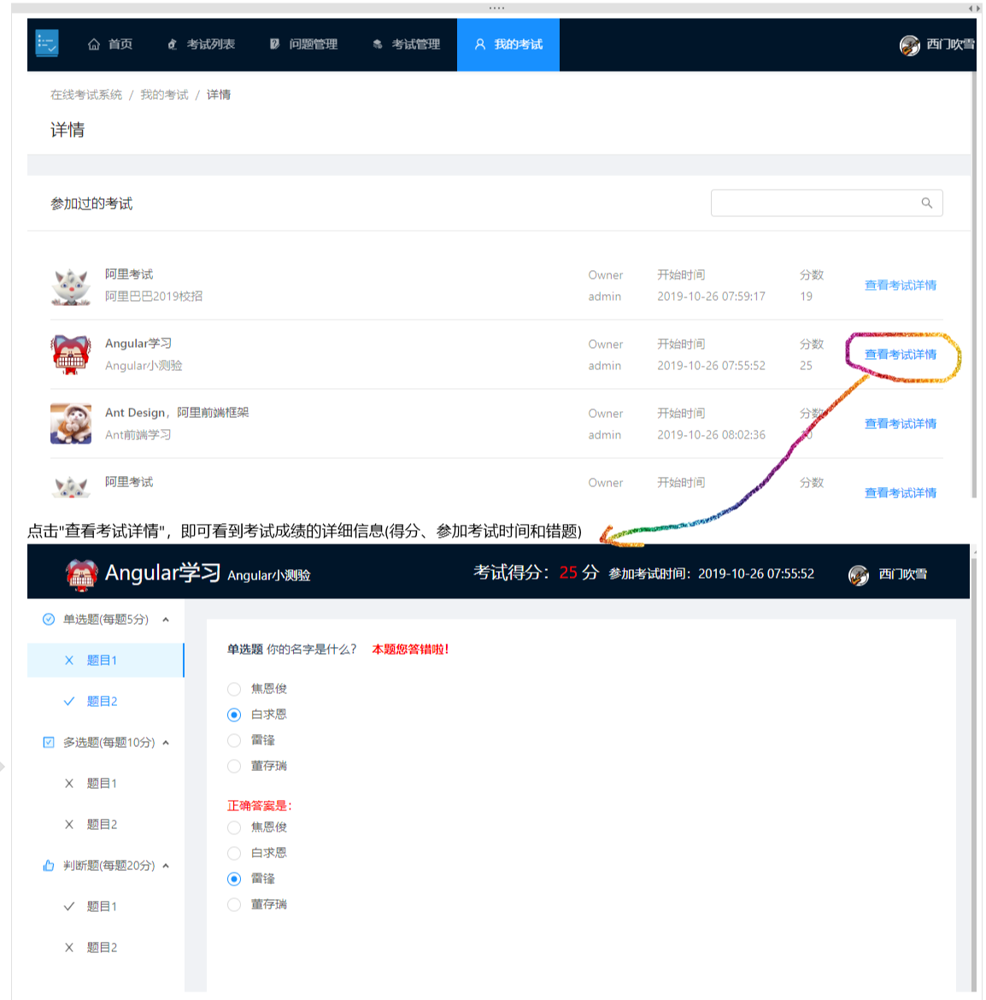

# spring-boot-online-exam


### 介绍
基于springboot的在线考试系统 

### 功能简介

+ 支持单选题、多选题、判断题
+ 支持学生(student)、教师(teacher)、管理员(admin)三种角色
  + 学生：参加考试和查看我的考试
  + 教师：学生的所有权限+创建/编辑题目+创建/编辑考试
  + 管理员：教师的所有权限+管理用户

### 软件架构

> 前后端分离，前段组件化，方便二次开发；后端

+ 后端采用SpringBoot+JPA++Swagger2+JWT校验,根据不同用户的权限返回给用户不同的数据
+ 后端采用Vue+AntDesign,组件化拆分，封装了很多公共组件，方便维护和二次开发

### 使用教程

+ 1.下载代码
 
  git clone https://github.com/Ultrasty/XP/edit/master
  ```
+ 2.初始化数据库
  
+ 3.启动后端
  
+ 4.启动前端
  + 进入到前端代码路径 `cd spring-boot-online-exam/frontend/exam/`
  + 安装依赖 `npm install`
  + 启动前端 `npm run serve`

### 功能图示

+ 1.管理题目
  + 1.1 题目列表
    
    > 
  + 1.2 题目创建
    
    > 
  + 1.3 题目更新
    
    > 
+ 2.考试管理
  + 2.1 考试列表
    
    > 
  + 2.2 考试创建
    
    > 
  + 2.3 考试更新(`还有点小bug，开发中`)
    
    > 
+ 3.我的考试
  + 3.1 参加考试
    > 在"考试列表"模块点击自己想参加的考试卡片即可
    > 
    > 
  + 3.2 考试记录查看
    
    > 


### Todo
+ `√`0.修复bug：题目创建失败
+ `√`1.考试详情编辑
+ 2.支持题目和考试的删除
  > 如果题目有关联的考试则必须先删除对应的考试，反过来删除考试则不用删除题目
+ `√`3.图片改成base64存到数据库中
+ 4.题干和选项支持富文本
+ 5.支持批量导入题目
+ 6.新增用户管理、学科管理功能
+ 7.老师能看到所有学生的成绩以及考试的统计信息
+ 8.更多的数据分析功能
